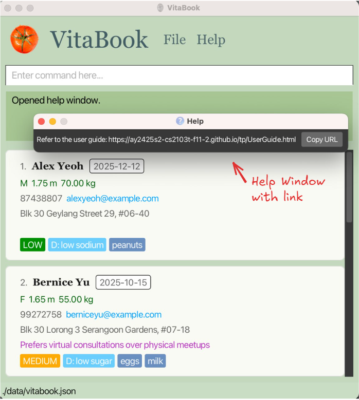
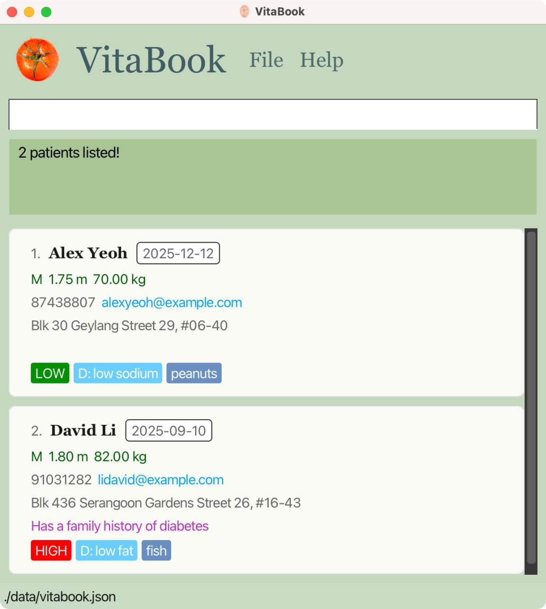

# AB-3 User Guide

AddressBook Level 3 (AB3) is a **desktop app for managing contacts, optimized for use via a  Line Interface** (CLI) while still having the benefits of a Graphical User Interface (GUI). If you can type fast, AB3 can get your contact management tasks done faster than traditional GUI apps.

<!-- * Table of Contents -->
<page-nav-print />

--------------------------------------------------------------------------------------------------------------------

## Quick start

1. Ensure you have Java `17` or above installed in your Computer. 
   **Mac users:** Ensure you have the precise JDK version prescribed [here](https://se-education.org/guides/tutorials/javaInstallationMac.html).

1. Download the latest `.jar` file from [here](https://github.com/se-edu/addressbook-level3/releases).

1. Copy the file to the folder you want to use as the _home folder_ for your AddressBook.

1. Open a command terminal, `cd` into the folder you put the jar file in, and use the `java -jar addressbook.jar` command to run the application. 
   A GUI similar to the below should appear in a few seconds. Note how the app contains some sample data. 
   

1. Type the command in the command box and press Enter to execute it. e.g. typing **`help`** and pressing Enter will open the help window. 
   Some example commands you can try:

   * `list` : Lists all contacts.

   * `add n/John Doe p/98765432 e/johnd@example.com a/John street, block 123, #01-01` : Adds a contact named `John Doe` to the Address Book.

   * `delete 3` : Deletes the 3rd contact shown in the current list.

   * `clear` : Deletes all contacts.

   * `exit` : Exits the app.

1. Refer to the [Features](#features) below for details of each command.

--------------------------------------------------------------------------------------------------------------------

## Features

<box type="info" seamless>

**Notes about the command format:** 

* Words in `UPPER_CASE` are the parameters to be supplied by the user. 
  e.g. in `add n/NAME`, `NAME` is a parameter which can be used as `add n/John Doe`.

* Items in square brackets are optional. 
  e.g `n/NAME [al/ALLERGY]` can be used as `n/John Doe al/friend` or as `n/John Doe`.

* Items with `…`​ after them can be used multiple times including zero times. 
  e.g. `[al/ALLERGY]…​` can be used as ` ` (i.e. 0 times), `t/friend`, `t/friend t/family` etc.

* Parameters can be in any order. 
  e.g. if the command specifies `n/NAME p/PHONE_NUMBER`, `p/PHONE_NUMBER n/NAME` is also acceptable.

* Extraneous parameters for commands that do not take in parameters (such as `help`, `list`, `exit` and `clear`) will be ignored. 
  e.g. if the command specifies `help 123`, it will be interpreted as `help`.

* If you are using a PDF version of this document, be careful when copying and pasting commands that span multiple lines as space characters surrounding line-breaks may be omitted when copied over to the application.
</box>

### Viewing help : `help`

Shows a message explaning how to access the help page.

Format: `help`

### Adding a person: `add`

Adds a person to the address book.

Format: `add n/NAME p/PHONE_NUMBER e/EMAIL a/ADDRESS [al/ALLERGY]…​`

<box type="tip" seamless>

**Tip:** A person can have any number of tags (including 0)
</box>

Examples:
* `add n/John Doe p/98765432 e/johnd@example.com a/John street, block 123, #01-01`
* `add n/Betsy Crowe t/friend e/betsycrowe@example.com a/Newgate Prison p/1234567 t/criminal`

### Listing all persons : `list`

Shows a list of all persons in the address book.

Format: `list`

### Editing a person : `edit`

Edits an existing person in the address book.

Format: `edit INDEX [n/NAME] [p/PHONE] [e/EMAIL] [a/ADDRESS] [al/ALLERGY]…​`

* Edits the person at the specified `INDEX`. The index refers to the index number shown in the displayed person list. The index **must be a positive integer** 1, 2, 3, …​
* At least one of the optional fields must be provided.
* Existing values will be updated to the input values.
* When editing tags, the existing tags of the person will be removed i.e adding of tags is not cumulative.
* You can remove all the person’s tags by typing `t/` without
    specifying any tags after it.

Examples:
*  `edit 1 p/91234567 e/johndoe@example.com` Edits the phone number and email address of the 1st person to be `91234567` and `johndoe@example.com` respectively.
*  `edit 2 n/Betsy Crower t/` Edits the name of the 2nd person to be `Betsy Crower` and clears all existing tags.

### Locating persons by name: `find`

Finds persons whose names contain any of the given keywords.

Format: `find KEYWORD [MORE_KEYWORDS]`

* The search is case-insensitive. e.g `hans` will match `Hans`
* The order of the keywords does not matter. e.g. `Hans Bo` will match `Bo Hans`
* Only the name is searched.
* Only full words will be matched e.g. `Han` will not match `Hans`
* Persons matching at least one keyword will be returned (i.e. `OR` search).
  e.g. `Hans Bo` will return `Hans Gruber`, `Bo Yang`

Examples:
* `find John` returns `john` and `John Doe`
* `find alex david` returns `Alex Yeoh`, `David Li` 
  

### Deleting a person : `delete`

Deletes the specified person from the address book.

Format: `delete INDEX`

* Deletes the person at the specified `INDEX`.
* The index refers to the index number shown in the displayed person list.
* The index **must be a positive integer** 1, 2, 3, …​

Examples:
* `list` followed by `delete 2` deletes the 2nd person in the address book.
* `find Betsy` followed by `delete 1` deletes the 1st person in the results of the `find` command.

### Clearing all entries : `clear`

Clears all entries from the address book.

Format: `clear`

### Exiting the program : `exit`

Exits the program.

Format: `exit`

### Saving the data

AddressBook data are saved in the hard disk automatically after any command that changes the data. There is no need to save manually.

### Editing the data file

AddressBook data are saved automatically as a JSON file `[JAR file location]/data/addressbook.json`. Advanced users are welcome to update data directly by editing that data file.

<box type="warning" seamless>

**Caution:**
If your changes to the data file makes its format invalid, AddressBook will discard all data and start with an empty data file at the next run.  Hence, it is recommended to take a backup of the file before editing it. 
Furthermore, certain edits can cause the AddressBook to behave in unexpected ways (e.g., if a value entered is outside the acceptable range). Therefore, edit the data file only if you are confident that you can update it correctly.
</box>

### Archiving data files `[coming in v2.0]`

_Details coming soon ..._

--------------------------------------------------------------------------------------------------------------------

## FAQ

**Q**: What is VitaBook?
**A**: VitaBook is a desktop application designed for freelance nutritionists to manage patient information efficiently
using a typing-preferred interface. It is optimized for fast data entry and offline use.

**Q**: Who is VitaBook for?
**A**: VitaBook is for freelance or home-based nutritionists who need to keep track of patient profiles, dietary
restrictions, medical notes, appointments, and reminders — all from a lightweight CLI app.

**Q**: How is VitaBook different from a regular address book?
**A**: In addition to contact details, VitaBook stores patient-specific information like gender, height, weight,
dietary tags, allergies, priority levels, and meeting dates. It’s tailored to healthcare use cases. It’s optimized for
fast typers, offers structured patient management, and prevents data entry mistakes with input validation.

**Q**: Do I need to install any special software to run VitaBook?
**A**: You just need to have Java 17 installed. No installation is required — simply run the JAR file.

**Q**: What kind of information can I store about a patient?
**A**: You can store:

Name, phone, email, address
Gender, height, weight
Dietary tags (e.g., low sodium, peanuts)
Meeting date
Priority level (LOW, MEDIUM, HIGH)
Remarks

**Q**:What happens when I delete a patient?
**A**: All of their information (e.g. diet, priority, meeting date, medical notes) will be permanently deleted from
the address book.

**Q**: Can I undo a mistaken command?
**A**: Yes, you can! Just write undo, followed by the patient index, the field to be changed, and the updated info

**Q**: Can I add custom fields or conditions?
**A**: Any other relevant info other than the fields provided can be added to the remark field as a workaround

**Q**: Can I import data from another app or CSV file?
**A**: Not yet — but you can manually edit the JSON file (data/addressbook.json) to add patients if you're comfortable
with the format.
--------------------------------------------------------------------------------------------------------------------

## Known issues

- **Allergy fields are case-sensitive**
  Adding allergy tags like `peanuts` and `Peanuts` results in two different tags being stored. This can lead to duplicates or confusion when filtering/searching.

- **No support for recurring meeting dates or reminders**
  Only a single meeting date (`md/`) can be stored per patient, with no repeat scheduling or notification support.

- **Commands must follow strict ordering and prefixes**
  Forgetting a prefix (like `n/`) or misordering fields will result in an invalid command, even if the content is correct.

- **No concurrency or multi-user support**
  VitaBook is designed as a single-user desktop application. Running two instances may cause file conflicts or data loss.

- **No graphical support for charts or health analytics**
  Patient data is presented in text format only. Features like BMI calculation, graphs, or dashboards are not supported.

- **Application crashes if `addressbook.json` is manually corrupted**
  If the user edits or corrupts the storage file manually, VitaBook may fail to start or load a blank state.
--------------------------------------------------------------------------------------------------------------------

## Command Summary

Action        | Format, Examples
--------------|--------------------------------------------------------------------------------------------------------------------------------------------------------------------------------------------
**Add**       | `add n/NAME g/GENDER h/HEIGHT w/WEIGHT p/PHONE e/EMAIL a/ADDRESS d/DIET pr/PRIORITY md/MEETING_DATE [t/TAG]…` e.g., `add n/Alex Yeoh g/M h/1.75 w/70 p/87438807 e/alex@example.com a/Blk 30 d/low sodium pr/LOW md/2025-12-12 t/peanuts`
**Edit**      | `edit INDEX [n/NAME] [g/GENDER] [h/HEIGHT] [w/WEIGHT] [p/PHONE] [e/EMAIL] [a/ADDRESS] [d/DIET] [pr/PRIORITY] [md/MEETING_DATE] [t/TAG]…` e.g., `edit 1 d/low sugar w/68 pr/MEDIUM`
**Delete**    | `delete INDEX` e.g., `delete 3`
**List**      | `list`
**Find**      | `find KEYWORD [MORE_KEYWORDS]` e.g., `find Alex sugar`
**Sort**      | `sort FIELD` e.g., `sort priority`, `sort name`, `sort weight`
**Priority**  | `pr INDEX PRIORITY` e.g., `pr 2 HIGH`
**Remark**    | `remark INDEX r/REMARK` e.g., `remark 1 r/Likes protein-rich foods`
**Clear**     | `clear`
**Help**      | `help`

